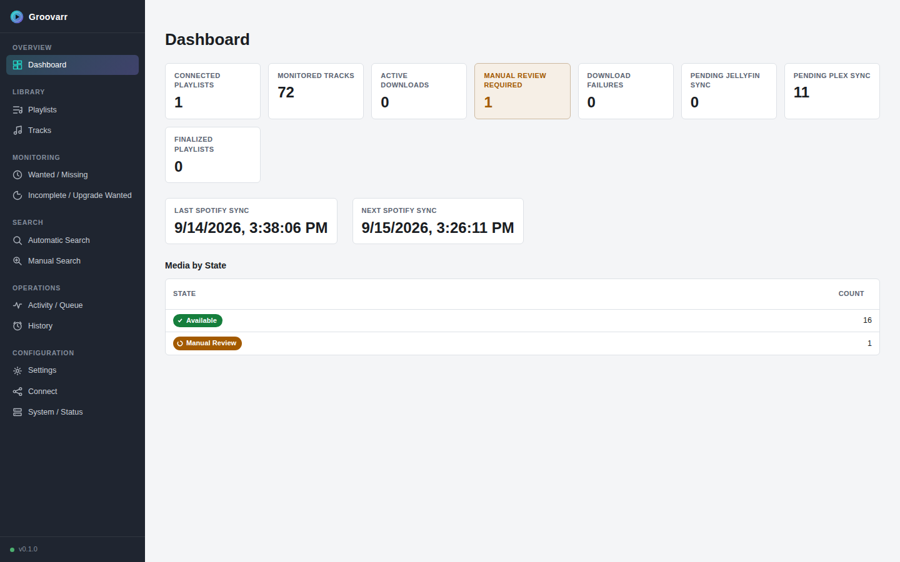
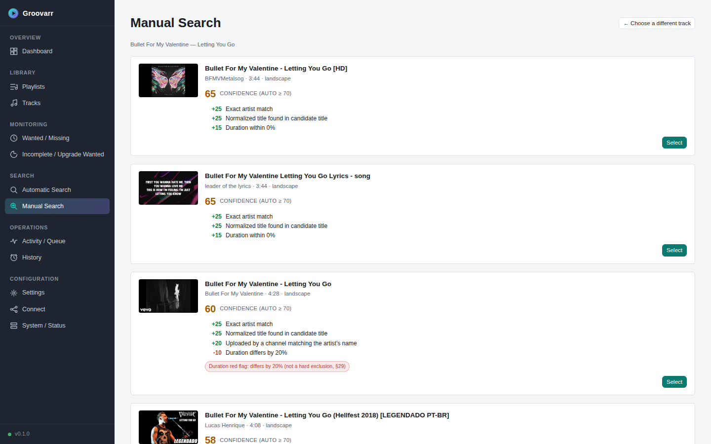
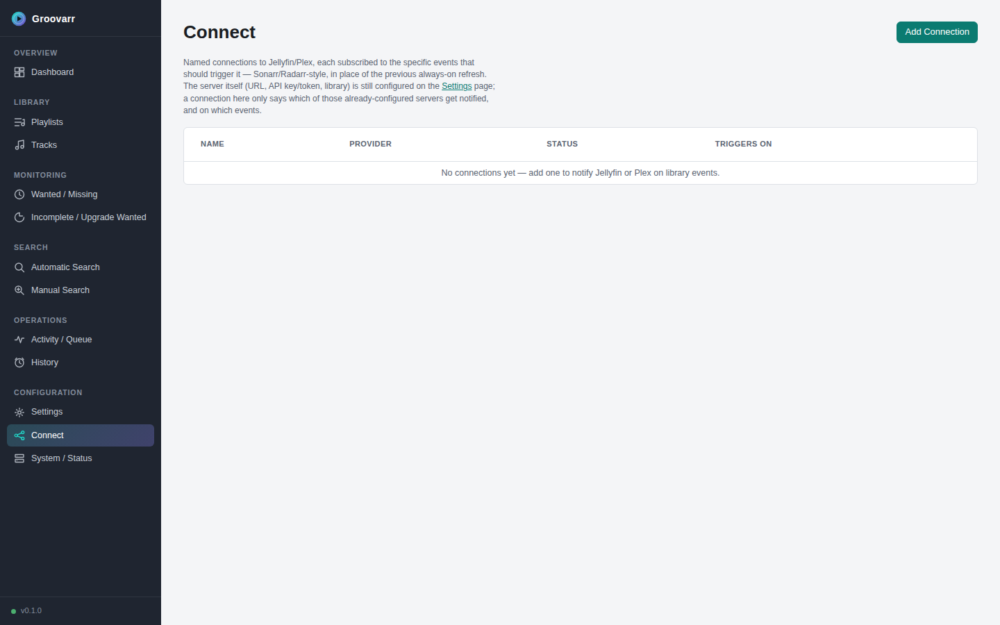
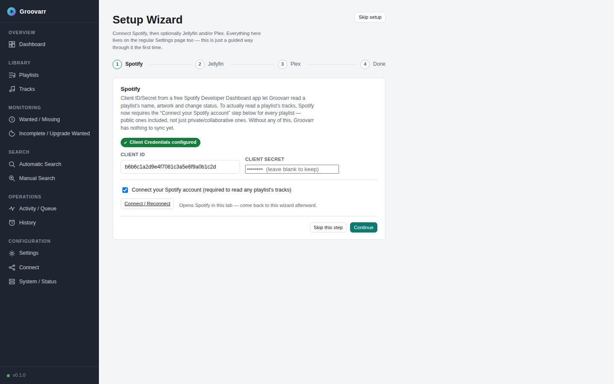

# Groovarr

Groovarr is a self-hosted, single-user, Docker-first *Arr-style application that turns your
Spotify playlists (and, optionally, your Liked Songs) into a deduplicated, correctly-tagged local
library of music videos, kept in sync with Jellyfin and/or Plex. It isn't a one-shot downloader
script — it's a stateful library manager in the spirit of Sonarr/Radarr, with monitored items, a
wanted/missing list, automatic vs. manual search with a fully explainable score breakdown behind
every candidate, a download queue, history, and per-connection Jellyfin/Plex notifications. The
pipeline runs Spotify (canonical playlist/track truth) → local library check → YouTube discovery
→ deterministic weighted-scoring candidate selection → automatic acquisition or manual review →
download/remux (with automatic hardware-accelerated transcoding where available) → metadata,
artwork, and lyrics enrichment → atomic import → Jellyfin/Plex library refresh → playlist
reconstruction in Spotify order.



## Features

- **Spotify-driven library**: connect any playlist (public, private/collaborative via PKCE, or
  your account's Liked Songs as a pseudo-playlist) and Groovarr keeps a monitored, deduplicated
  track list in sync with it.
- **Explainable matching**: every YouTube candidate is scored by a deterministic, transparent
  rule set — Automatic Search shows what was decided and why, Manual Search shows the same
  breakdown so you can second-guess it and pick a different candidate yourself.
- **Full acquisition pipeline**: yt-dlp download → ffmpeg remux/transcode (hardware-accelerated
  via VAAPI/QSV/NVENC when the host exposes a GPU, software fallback otherwise) → ffprobe
  validation → metadata/artwork tagging → LRCLIB lyrics → atomic, crash-safe import.
- **Jellyfin & Plex sync**: library refresh and Spotify-ordered playlist reconstruction on both,
  plus a Sonarr/Radarr-style **Connect** framework — named notification connections, each
  subscribed to just the library events that should trigger it.
- **Guided first-run Setup Wizard**: a step-by-step Spotify → Jellyfin → Plex connection flow for
  a brand-new install (also reachable any time from Settings); everything it does is equally
  available on the regular Settings page.
- **Operational visibility**: Wanted/Missing and Incomplete/Upgrade-Wanted queues, a live
  Activity/Queue view, full History, and a System/Status page with runtime health, disk usage,
  YouTube Data API quota usage, and pinned yt-dlp/FFmpeg version/update checks.
- **Resilient by design**: reference-counted deletes, crash-recovery reconciliation for
  interrupted downloads/replacements, and a yt-dlp PO-Token provider that starts automatically
  alongside the app to mitigate YouTube's anti-bot restrictions — no extra setup required.

## Screenshots

| Manual Search — explainable scoring | Connect (Jellyfin/Plex notifications) |
|---|---|
|  |  |

| Setup Wizard |
|---|
|  |

## Quick start (Docker Compose)

1. From the `docker/` directory, copy the example environment file and fill in your values
   (Compose looks for `.env` next to `docker-compose.yml`, so it must live in `docker/`, not the
   repo root):

   ```bash
   cd docker
   cp ../.env.example .env
   ```

2. Start Groovarr:

   ```bash
   docker compose up -d --build
   ```

3. Open `http://localhost:<PORT>` (see `docker/.env`). On a fresh install with no Spotify
   credentials configured yet, Groovarr automatically opens the guided **Setup Wizard** to walk
   you through Spotify, then optionally Jellyfin and Plex — everything it sets can also be
   changed later from the Settings page directly.

Two things worth knowing about the Compose file itself:

- **Hardware-accelerated transcoding** (VAAPI/QSV/NVENC) is optional and off by default. If your
  host has a usable GPU, uncomment the matching block in `docker/docker-compose.yml` — for an
  Intel/AMD iGPU or dGPU that's simply passing through `/dev/dri` (`devices: ["/dev/dri:/dev/dri"]`);
  NVIDIA needs the NVIDIA Container Toolkit instead. Groovarr auto-detects whatever's actually
  reachable at startup and safely falls back to software encoding if nothing is — see Settings →
  Media Management → Hardware Acceleration.
- **The yt-dlp PO-Token provider** (a small helper that mitigates YouTube's anti-bot restrictions)
  is started automatically by `docker/entrypoint.sh` on every boot, bound to `127.0.0.1` only.
  There's nothing to configure — if it fails to start for any reason, yt-dlp just proceeds exactly
  as it would without it.

## Documentation

Full research, architecture decisions, and rationale live in [`docs/`](docs/), starting with
[`docs/00-research-and-architecture-review.md`](docs/00-research-and-architecture-review.md).
A concise, code-facing developer map is in [`docs/architecture.md`](docs/architecture.md); short
records of individual decisions are in [`docs/adr/`](docs/adr/); the security posture is in
[`docs/security.md`](docs/security.md). Third-party project licenses are tracked in
[`docs/THIRD_PARTY_NOTICES.md`](docs/THIRD_PARTY_NOTICES.md). Contributing? Start with
[`CONTRIBUTING.md`](CONTRIBUTING.md).
